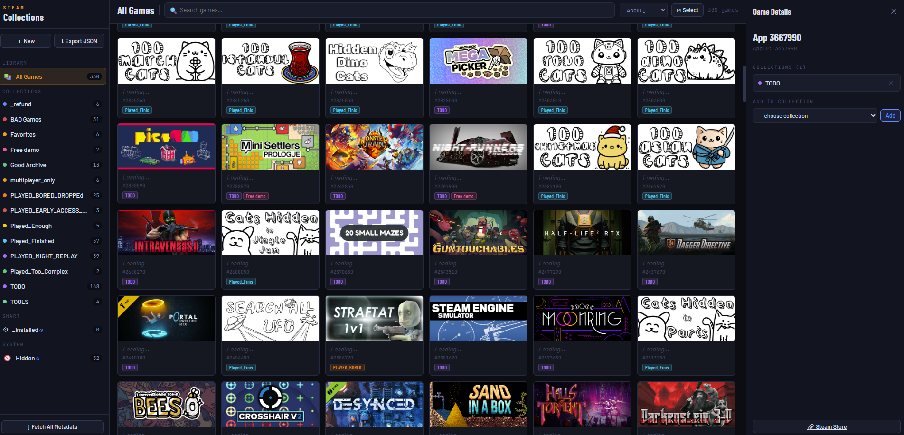

# SteamCollectionsManager

- Load your "C:\Program Files (x86)\Steam\userdata\<id>\config\cloudstorage\cloud-storage-namespace-1.json" into this to view collections and games in them.
- Modify collections as you like.
  - Pick and drag to Move to collection
  - Pick and drag while holding shift to Copy to collection
- Export
- Exit steam and replace the JSON

# Screenshot

